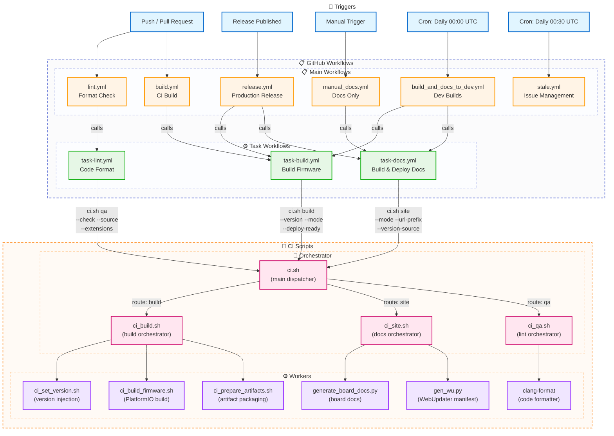

# GitHub Actions Workflows Documentation

This document provides a overview of all GitHub Actions workflows in the OpenMQTTGateway project.

---

## Architecture Overview

The workflow system is organized in two layers:

### **Main Workflows** (User-facing triggers)
Entry points triggered by user actions, schedules, or events:
- `build.yml` - CI validation on push/PR
- `build_and_docs_to_dev.yml` - Daily development builds
- `release.yml` - Production releases
- `manual_docs.yml` - Documentation deployment
- `lint.yml` - Code formatting check
- `stale.yml` - Issue management

### **Task Workflows** (Reusable components)
Parameterized building blocks called by main workflows:
- `task-build.yml` - Configurable firmware build
- `task-docs.yml` - Configurable documentation build
- `task-lint.yml` - Configurable code formatting check

---

## Workflow Overview Table

| Workflow | Trigger | Purpose | Artifacts |
|----------|---------|---------|-----------|
| `build.yml` | Push, Pull Request | CI Build Validation | Firmware binaries (7 days) |
| `build_and_docs_to_dev.yml` | Daily Cron, Manual | Development Builds + Docs | Firmware + Docs deployment |
| `release.yml` | Release Published | Production Release | Release assets + Docs |
| `manual_docs.yml` | Manual, Workflow Call | Documentation Only | GitHub Pages docs |
| `lint.yml` | Push, Pull Request | Code Format Check | None |
| `stale.yml` | Daily Cron | Issue Management | None |
| **`task-build.yml`** | **Workflow Call** | **Reusable Build Logic** | **Configurable** |
| **`task-docs.yml`** | **Workflow Call** | **Reusable Docs Logic** | **GitHub Pages** |
| **`task-lint.yml`** | **Workflow Call** | **Reusable Lint Logic** | **None** |

---

## Detailed Workflow Documentation

### 1. `build.yml` - Continuous Integration Build

**Purpose**: Validates that code changes compile successfully across all supported hardware platforms.

**Triggers**:
- **Push**: Every commit pushed to any branch
- **Pull Request**: Every PR creation or update

**What it does**:
1. **Build job**: Calls `task-build.yml` with CI parameters
   - Builds firmware for **83 hardware environments** in parallel
2. **Documentation job**: Inline job that validates docs build (doesn't deploy)
   - Downloads common config from theengs.io
   - Runs `npm install` and `npm run docs:build`
   - Uses Node.js 14.x

**Technical Details**:
- **Calls**: `task-build.yml` only (documentation is inline)
- Python version: 3.13 (for build job)
- Build strategy: Parallel matrix via task workflow
- Artifact retention: 7 days
- Development OTA: Disabled (`enable-dev-ota: false`)

**Outputs**:
- Firmware binaries for each environment (83 artifacts)
- No documentation deployment (validation only)

**Use Case**: Ensures no breaking changes before merge. Fast feedback for developers.

**Execution Context**: Runs for ALL contributors on ALL branches.

---

### 2. `build_and_docs_to_dev.yml` - Development Deployment Pipeline

**Purpose**: Creates nightly development builds and deploys documentation to the `/dev` subdirectory for testing.

**Triggers**:
- **Schedule**: Daily at midnight UTC (`0 0 * * *`)
- **Manual**: Via workflow_dispatch button

**What it does**:
1. **Prepare job**: Generates 6-character short SHA
2. **Build job**: Calls `task-build.yml` with development parameters
   - Builds firmware for **83 hardware environments** in parallel
   - Enables development OTA updates with SHA commit version
3. **Deploy job**: Prepares and uploads assets
   - Creates library dependency zips for each board
   - Generates source code zip
   - Removes test environment binaries
4. **Documentation job**: Calls `task-docs.yml` with development parameters
   - Deploys to `/dev` subdirectory
   - Adds "DEVELOPMENT" watermark
   - Runs PageSpeed Insights

**Technical Details**:
- **Calls**: `task-build.yml` + `task-docs.yml`
- Python version: 3.13 (build), 3.11 (docs)
- Node.js version: 16.x (docs)
- Repository restriction: Hardcoded to `1technophile` owner only
- Artifact retention: 1 day
- Build flag: `enable-dev-ota: true` (passed to task-build.yml)

**Outputs**:
- Firmware binaries with `-firmware.bin` suffix
- Bootloader and partition binaries
- Library dependency zips per board
- Source code zip
- Documentation deployed to `docs.openmqttgateway.com/dev/`

**Version Labeling**:
- Git SHA (6 chars) injected into firmware
- Docs tagged: "DEVELOPMENT SHA:XXXXXX TEST ONLY"

**Use Case**: Daily bleeding-edge builds for early adopters and testing. Preview documentation changes.

**Execution Context**: Only runs on `1technophile` repository owner. Forks will skip this workflow automatically.

---

### 3. `release.yml` - Production Release Pipeline

**Purpose**: Creates official release builds when a new version is published.

**Triggers**:
- **Release**: When a GitHub release is published (tagged)

**What it does**:
1. **Prepare job**: Extracts version tag and release info
2. **Build job**: Calls `task-build.yml` with production parameters
   - Builds firmware for **83 hardware environments** in parallel
   - Injects release tag version into firmware
3. **Deploy job**: Prepares and uploads release assets
   - Downloads all build artifacts
   - Reorganizes for `prepare_deploy.sh` script
   - Creates library zips and source zip
   - Uploads to GitHub Release
4. **Documentation job**: Calls `task-docs.yml` for production docs

**Technical Details**:
- **Calls**: `task-build.yml` + `task-docs.yml`
- Python version: 3.13 (build), 3.11 (docs)
- Node.js version: 18.x
- Build flag: Standard (no DEVELOPMENTOTA)
- Artifact retention: 90 days
- Uses `prepare_deploy.sh` script for asset preparation

**Outputs**:
- Production firmware binaries attached to GitHub Release
- Library zips per board
- Source code zip
- Production documentation at `docs.openmqttgateway.com/`

**Version Labeling**:
- Git tag (e.g., `v1.2.3`) injected into firmware and `latest_version.json`

**Workflow Chain**:
```
prepare → build (task-build.yml) → deploy → documentation (task-docs.yml)
```

**Use Case**: Official releases for end users. Stable, versioned firmware.

**Execution Context**: Triggered by repository maintainers creating releases.

---

### 4. `manual_docs.yml` - Documentation Deployment

**Purpose**: Entry point for standalone documentation deployment to GitHub Pages.

**Triggers**:
- **Manual**: Via workflow_dispatch button
- **Workflow Call**: Can be called by other workflows (legacy compatibility)

**What it does**:
1. Calls `task-docs.yml` with production parameters
2. Deploys to root directory (`/`) of GitHub Pages

**Technical Details**:
- **Calls**: `task-docs.yml`
- Python version: 3.11
- Node.js version: 14.x
- Version source: Latest GitHub release tag
- WebUploader manifest: Enabled

**Outputs**:
- Production documentation at `docs.openmqttgateway.com/`
- Custom domain: `docs.openmqttgateway.com` (via CNAME)

**Use Case**: Standalone documentation updates without full release process.

**Execution Context**: Manual trigger or legacy workflow calls.

---

### 5. `lint.yml` - Code Format Validation

**Purpose**: Ensures code follows consistent formatting standards.

**Triggers**:
- **Push**: Every commit pushed to any branch
- **Pull Request**: Every PR creation or update

**What it does**:
1. Calls `task-lint.yml` with specific parameters
2. Checks formatting in `./main` directory only

**Technical Details**:
- **Calls**: `task-lint.yml`
- clang-format version: 9
- File extensions: `.h`, `.ino` (not `.cpp`)
- Source directory: `main` (single directory)

**Configuration**:
```yaml
source: 'main'
extensions: 'h,ino'
clang-format-version: '9'
```

**Use Case**: Maintains code quality and consistency. Prevents formatting debates in PRs.

**Execution Context**: Runs for ALL contributors on ALL branches.

---

### 6. `stale.yml` - Issue and PR Management

**Purpose**: Automatically closes inactive issues and pull requests to reduce maintenance burden.

**Triggers**:
- **Schedule**: Daily at 00:30 UTC (`30 0 * * *`)

**What it does**:
1. Marks issues/PRs as stale after 90 days of inactivity
2. Closes stale issues/PRs after 14 additional days
3. Exempts issues labeled "enhancement"

**Configuration**:
- Stale after: 90 days
- Close after: 14 days (104 days total)
- Stale label: `stale`
- Exempt labels: `enhancement`

**Messages**:
- Stale: "This issue is stale because it has been open for 90 days with no activity."
- Close: "This issue was closed because it has been inactive for 14 days since being marked as stale."

**Use Case**: Housekeeping. Reduces backlog of abandoned issues.

**Execution Context**: Automated maintenance by GitHub bot.

---

## Task Workflows (Reusable Components)

### 7. `task-build.yml` - Reusable Build Workflow

**Purpose**: Parameterized firmware build logic used by multiple workflows.

**Trigger**: `workflow_call` only (called by other workflows)

**Parameters**:
- `python-version`: Python version (default: '3.13')
- `enable-dev-ota`: Enable development OTA (default: false)
- `version-tag`: Version to inject (default: 'unspecified')
- `artifact-retention-days`: Artifact retention (default: 7)
- `artifact-name-prefix`: Artifact name prefix (default: '')
- `prepare-for-deploy`: Prepare for deployment (default: false)

**What it does**:
1. **Load environments**: Reads environment list from `environments.json`
2. **Matrix build**: Builds all 83 environments in parallel
3. **Build execution**: Calls unified `ci.sh build <environment> [OPTIONS]`:
   - `<environment>`: Target hardware (e.g., `esp32dev-ble`)
   - `--version <tag>`: Version to inject (SHA for dev, tag for prod)
   - `--mode <dev|prod>`: Build mode (enables/disables OTA)
   - `--deploy-ready`: Prepare artifacts for deployment
   - `--output <dir>`: Output directory for artifacts (default: `generated/artifacts/`)

**Command Flow**:
```bash
./scripts/ci.sh build esp32dev-ble --version v1.8.0 --mode prod --deploy-ready
    ↓
    ├─→ ci_build.sh (orchestrator)
    │   ├─→ ci_set_version.sh v1.8.0 [--dev]
    │   ├─→ ci_build_firmware.sh esp32dev-ble [--dev-ota]
    │   └─→ ci_prepare_artifacts.sh esp32dev-ble [--deploy] → outputs to generated/artifacts/
```

**Technical Details**:
- Runs on: Ubuntu latest
- PlatformIO version: 6.1.18 (custom fork: `pioarduino/platformio-core`)
- Python package manager: `uv` (astral-sh/setup-uv@v6)
- Strategy: Matrix with fail-fast: false
- Main orchestrator: `ci.sh` → `ci_build.sh` → sub-scripts

**Callers**:
- `build.yml` (CI validation)
- `build_and_docs_to_dev.yml` (development builds)
- `release.yml` (production releases)

---

### 8. `task-docs.yml` - Reusable Documentation Workflow

**Purpose**: Parameterized documentation build and deployment logic.

**Trigger**: `workflow_call` only (called by other workflows)

**Parameters**:
- `python-version`: Python version (default: '3.11')
- `node-version`: Node.js version (default: '14.x')
- `version-source`: Version source ('release', 'git-tag', 'custom')
- `custom-version`: Custom version string (optional)
- `base-path`: Base URL path (default: '/')
- `destination-dir`: Deploy directory (default: '.')
- `generate-webuploader`: Generate WebUploader manifest (default: true)
- `webuploader-args`: WebUploader generation arguments (optional)
- `run-pagespeed`: Run PageSpeed Insights (default: false)
- `pagespeed-url`: URL for PageSpeed test (optional)

**What it does**:
1. **Build documentation**: Calls unified `ci.sh site [OPTIONS]`:
   - `--mode <dev|prod>`: Documentation mode
   - `--custom-version <ver>`: Custom version string
   - `--version-source <release|custom>`: Version source
   - `--url-prefix <path>`: Base URL path (e.g., `/dev/`)
   - `--webuploader-args <args>`: WebUploader options
   - `--no-webuploader`: Skip manifest generation
2. **Deploy**: Publishes to GitHub Pages using `peaceiris/actions-gh-pages@v3`
3. **PageSpeed test**: Optionally runs performance audit

**Command Flow**:
```bash
./scripts/ci.sh site --mode prod --version-source release --url-prefix /
    ↓
    └─→ ci_site.sh (orchestrator)
        ├─→ generate_board_docs.py (auto-generate board docs)
        ├─→ npm run docs:build (VuePress compilation)
        └─→ gen_wu.py (WebUpdater manifest)
```

**Callers**:
- `build_and_docs_to_dev.yml` (dev docs to `/dev`)
- `release.yml` (production docs to `/`)
- `manual_docs.yml` (manual production docs)

---

### 9. `task-lint.yml` - Reusable Lint Workflow

**Purpose**: Parameterized code formatting validation.

**Trigger**: `workflow_call` only (called by other workflows)

**Parameters**:
- `source`: Source directories to lint (default: './lib ./main')
- `extensions`: File extensions to check (default: 'h,ino,cpp')
- `clang-format-version`: clang-format version (default: '9')
- `exclude-pattern`: Pattern to exclude (optional)

**What it does**:
1. Checks out code
2. Installs clang-format (specified version)
3. Runs unified `ci.sh qa [OPTIONS]`:
   - `--check`: Validation mode (exit on violations)
   - `--fix`: Auto-fix formatting issues
   - `--source <dir>`: Directory to lint
   - `--extensions <list>`: File extensions (comma-separated)
   - `--clang-format-version <ver>`: Formatter version
4. Fails if formatting violations found

**Command Flow**:
```bash
./scripts/ci.sh qa --check --source main --extensions h,ino --clang-format-version 9
    ↓
    └─→ ci_qa.sh (formatter)
        └─→ clang-format (checks/fixes code style)
```

**Technical Details**:
- Script: `ci_qa.sh` (custom formatting check script)
- Install: `clang-format-$version` via apt-get
- Default source: `main` (single directory)
- Default extensions: `h,ino` (not cpp)

**Callers**:
- `lint.yml` (CI lint check)

**Default Behavior**: If called without parameters, lints `main` directory for `.h` and `.ino` files.

---

## Workflow Dependencies and Call Chain



### Workflow Relationships

**Main → Task Mapping**:
- `build.yml` → calls `task-build.yml` (also contains inline documentation job)
- `lint.yml` → calls `task-lint.yml`
- `build_and_docs_to_dev.yml` → calls `task-build.yml` + `task-docs.yml` (with prepare/deploy jobs)
- `release.yml` → calls `task-build.yml` + `task-docs.yml` (with prepare/deploy jobs)
- `manual_docs.yml` → calls `task-docs.yml`
- `stale.yml` → standalone (no dependencies)

**Task → CI Script Mapping**:
- `task-build.yml` → `ci.sh build <env> --version --mode --deploy-ready`
  - Routes to: `ci_build.sh` → `ci_set_version.sh`, `ci_build_firmware.sh`, `ci_prepare_artifacts.sh`
  - Output: `generated/artifacts/` (default, can be overridden with `--output`)
- `task-docs.yml` → `ci.sh site --mode --version-source --url-prefix --webuploader-args`
  - Routes to: `ci_site.sh` → `generate_board_docs.py`, `gen_wu.py`, VuePress
  - Output: `generated/site/`
- `task-lint.yml` → `ci.sh qa --check --source --extensions --clang-format-version`
  - Routes to: `ci_qa.sh` → `clang-format`

**Job Dependencies**:
- `build_and_docs_to_dev.yml`: prepare → build (task) → deploy & documentation (task)
- `release.yml`: prepare → build (task) → deploy → documentation (task)

**Script Execution Flow**:
```
GitHub Action (task-*.yml)
    ↓
./scripts/ci.sh <command> [OPTIONS]  ← Main dispatcher
    ↓
./scripts/ci_<command>.sh            ← Command orchestrator
    ↓
./scripts/ci_*.sh / *.py             ← Worker scripts
```

---

## Environment Configuration

### Centralized Environment Management

All build environments are defined in `.github/workflows/environments.json`:

```json
{
  "environments": {
    "all": [ ...83 environments ],
    "metadata": {
      "totalCount": 83,
      "lastUpdated": "2024-12-25",
      "categories": {
        "esp32": 50,
        "esp8266": 20,
        "specialized": 13
      }
    }
  }
}
```

**Benefits**:
- ✅ Single source of truth
- ✅ Eliminates duplication across workflows
- ✅ Easier to maintain and update
- ✅ Consistent builds across CI/dev/release

### Environment Categories

**ESP32 Family** (~50 environments):
- Standard: `esp32dev-*` variants
- ESP32-S3: `esp32s3-*` variants
- ESP32-C3: `esp32c3-*` variants
- Specialized boards: M5Stack, Heltec, LilyGO, Theengs

**ESP8266 Family** (~20 environments):
- NodeMCU: `nodemcuv2-*` variants
- Sonoff: `sonoff-*` variants
- Generic: `esp8266-*` variants

**Specialized Boards** (~13 environments):
- Theengs Plug
- Theengs Bridge
- RF Bridge variants
- Custom board configurations

---

## Configuration Variables

### Repository Restrictions

**Development Builds** (`build_and_docs_to_dev.yml`):
- Hardcoded restriction: `github.repository_owner == '1technophile'`
- Only runs for the main repository owner
- Prevents accidental deployments from forks
- No configuration variable needed

**Release Builds** (`release.yml`):
- No repository restrictions
- Runs on any fork when a release is published
- Deploy step requires proper GitHub token permissions

**Documentation** (`manual_docs.yml`):
- No repository restrictions
- Can be triggered manually from any fork
- Requires GitHub Pages to be configured

---

## Glossary

- **Environment**: A specific hardware board + gateway combination (e.g., `esp32dev-ble`)
- **Matrix Build**: Parallel execution of builds across multiple environments
- **Artifact**: Build output stored temporarily for download (firmware binaries)
- **workflow_call**: GitHub Actions feature for calling one workflow from another
- **workflow_dispatch**: Manual trigger button for workflows
- **Task Workflow**: Reusable workflow component with parameterized inputs
- **Main Workflow**: Entry point workflow triggered by events or schedules
- **CNAME**: Custom domain configuration for GitHub Pages
- **OTA**: Over-The-Air firmware update capability
- **SHA**: Git commit hash used for version identification in dev builds

---

## Maintenance Notes

### CI/CD Script Architecture

**Main Entry Point**: `ci.sh` (unified interface)
- Commands: `build`, `site`, `qa`, `all`
- Routes to specialized orchestrators
- Provides consistent CLI across all operations

**Build System** (`ci.sh build`):
- PlatformIO 6.1.18 from custom fork: `pioarduino/platformio-core`
- Python package manager: `uv` for fast dependency installation
- Orchestrator: `ci_build.sh`
  - Worker: `ci_set_version.sh` (version injection)
  - Worker: `ci_build_firmware.sh` (PlatformIO compilation)
  - Worker: `ci_prepare_artifacts.sh` (artifact packaging)

**Documentation System** (`ci.sh site`):
- Documentation framework: VuePress
- Orchestrator: `ci_site.sh`
  - Worker: `generate_board_docs.py` (auto-generate board pages)
  - Worker: `gen_wu.py` (WebUpdater manifest)
  - External: Common config from theengs.io

**Code Quality** (`ci.sh qa`):
- Orchestrator: `ci_qa.sh`
  - Worker: `clang-format` version 9
  - Default scope: `main` directory, `.h` and `.ino` files

**Configuration**:
- Environment list: `.github/workflows/environments.json` (83 environments)
- Task workflows: `task-*.yml` (reusable GitHub Actions components)
- Repository owner restriction: Hardcoded to `1technophile` for dev deployments
- All scripts located in: `./scripts/`

**Local Development**:
```bash
# Build firmware locally
./scripts/ci.sh build esp32dev-ble --mode dev --version test

# Build documentation locally
./scripts/ci.sh site --mode dev --preview

# Check code format
./scripts/ci.sh qa --check

# Run complete pipeline
./scripts/ci.sh all esp32dev-ble --version v1.8.0
```

---

**Document Version**: 2.1  
**Last Updated**: December 29, 2025  
**Maintainer**: OpenMQTTGateway Development Team
