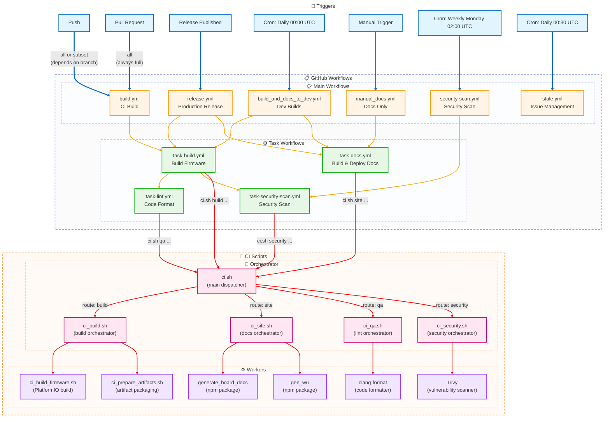

# GitHub Actions Workflows Documentation

This document provides an overview of all GitHub Actions workflows in the OpenMQTTGateway project.


## Architecture Overview

The workflow system is organized in two layers:

### **Main Workflows** (User-facing triggers)
Entry points triggered by user actions, schedules, or events:
- `build.yml` - CI validation on push/PR
- `build_and_docs_to_dev.yml` - Daily development builds
- `release.yml` - Production releases
- `manual_docs.yml` - Documentation deployment
- `security-scan.yml` - Security vulnerability scanning
- `stale.yml` - Issue management

### **Task Workflows** (Reusable components)
Parameterized building blocks called by main workflows:
- `task-build.yml` - Configurable firmware build
- `task-docs.yml` - Configurable documentation build
- `task-lint.yml` - Configurable code formatting check
- `task-security-scan.yml` - Configurable security scanning


## Workflow Overview Table

| Workflow | Trigger | Purpose | Artifacts |
|----------|---------|---------|-----------|
| `build.yml` | Push, Pull Request | CI Build Validation | Firmware binaries (7 days) |
| `build_and_docs_to_dev.yml` | Daily Cron, Manual | Development Builds + Docs | Firmware + Docs deployment |
| `release.yml` | Release Published | Production Release | Release assets + Docs |
| `manual_docs.yml` | Manual, Workflow Call | Documentation Only | GitHub Pages docs |
| `security-scan.yml` | Weekly Cron, Manual | Security Vulnerability Scanning | SARIF, SBOM reports |
| `stale.yml` | Daily Cron | Issue Management | None |
| **`task-build.yml`** | **Workflow Call** | **Reusable Build Logic** | **Configurable** |
| **`task-docs.yml`** | **Workflow Call** | **Reusable Docs Logic** | **GitHub Pages** |
| **`task-lint.yml`** | **Workflow Call** | **Reusable Lint Logic** | **None** |
| **`task-security-scan.yml`** | **Workflow Call** | **Reusable Security Scan** | **SARIF, SBOM, Reports** |


## Workflow Dependencies and Call Chain



### Workflow Relationships

**Main → Task Mapping**:
- `build.yml` → calls `task-build.yml` (also contains inline documentation job)
- `build_and_docs_to_dev.yml` → calls `task-build.yml` + `task-docs.yml`
- `release.yml` → calls `task-build.yml` + `task-docs.yml`
- `manual_docs.yml` → calls `task-docs.yml`
- `security-scan.yml` → calls `task-security-scan.yml`
- `stale.yml` → standalone (no dependencies)

**Task → CI Script Mapping**:
- `task-build.yml` → `ci.sh build --version --mode --deploy-ready`
  - Routes to: `ci_build.sh` → `ci_build_firmware.sh`, `ci_prepare_artifacts.sh`
  - Output: `generated/artifacts/firmware_build/`
- `task-docs.yml` → `ci.sh site --mode --version --url-prefix`
  - Routes to: `ci_site.sh` → `generate_board_docs` (npm), `gen_wu` (npm), VuePress
  - Output: `generated/site/`
- `task-lint.yml` → `ci.sh qa --check --source --extensions --clang-format-version`
  - Routes to: `ci_qa.sh` → `clang-format`
- `task-security-scan.yml` → `ci.sh security --scan-type --severity --generate-sbom`
  - Routes to: `ci_security.sh` → Trivy (vulnerability scanner)
  - Output: `generated/reports/` (SARIF, JSON, SBOM)

**Job Dependencies**:
- `build_and_docs_to_dev.yml`: prepare → build (task) → deploy & documentation (task)
- `release.yml`: prepare → build (task) → deploy → documentation (task)

**Script Execution Flow**:
```
GitHub Action (task-*.yml)
    ↓
./scripts/ci.sh <command> [OPTIONS]  ← Main dispatcher
    ↓
./scripts/ci_<command>.sh            ← Command orchestrator
    ↓
./scripts/ci_*.sh / *.py             ← Worker scripts
```

---

## Detailed Workflow Documentation

### 1. `build.yml` - Continuous Integration Build

**Purpose**: Validates that code changes compile successfully with intelligent environment selection based on branch importance.

**Triggers**:
- **Push**: Every commit pushed to any branch
- **Pull Request**: Every PR creation or update

**What it does**:
1. **Determine build scope**: Selects environment list based on branch name
   - **Full build** (`all` environment): All PRs and Push on important branches (development, master, edge, stable, release/*, hotfix/*)
   - **Quick build** (`ci` subset environment): All PRs and Push on non-critical branches
2. **Build job**: Calls `task-build.yml` with appropriate environment set
   - Builds firmware in parallel
3. **Documentation job**: Inline job that validates docs build (doesn't deploy)
   - Downloads common config from theengs.io
   - Runs `npm install` and `npm run docs:build`
   - Uses Node.js 14.x

**Technical Details**:
- **Calls**: `task-build.yml` only (documentation is inline)
- Python version: 3.13 (for build job)
- Build strategy: Parallel matrix via task workflow
- Artifact retention: 7 days
- Development OTA: Enabled (`enable-dev-ota: true`)
- Environment selection logic:
  - **Full build** (`all`): All Pull Requests + branches: development, master, edge, stable, release/*, hotfix/*
  - **Quick build** (`ci` subset): All other feature branches

**Outputs**:
- Firmware binaries for selected environments
- No documentation deployment (validation only)

**Use Case**: Ensures no breaking changes before merge. Fast feedback for feature branches (~10 min), comprehensive validation for PRs and critical branches (~40 min).

**Execution Context**: Runs for ALL contributors on ALL branches with smart scaling based on branch importance.

---

### 2. `build_and_docs_to_dev.yml` - Development Deployment Pipeline

**Purpose**: Creates nightly development builds and deploys documentation to the `/dev` subdirectory for testing.

**Triggers**:
- **Schedule**: Daily at midnight UTC (`0 0 * * *`)
- **Manual**: Via workflow_dispatch button

**What it does**:
1. **Prepare job**: Generates 6-character short SHA
2. **Handle-firmwares job**: Calls `task-build.yml` with development parameters
   - Builds firmware for **all environments** in parallel
   - Enables development OTA updates with SHA commit version
   - Artifact retention: 1 day
3. **Handle-documentation job**: Calls `task-docs.yml` with development parameters
   - Deploys to `/dev` subdirectory on GitHub Pages
   - Uses short SHA as version identifier
   - Runs PageSpeed Insights on dev site

**Technical Details**:
- **Calls**: `task-build.yml` + `task-docs.yml`
- Repository restriction: Hardcoded to `1technophile` owner only
- Version: 6-character short SHA (e.g., `abc123`)
- Documentation URL prefix: `/dev/`
- GitHub Pages destination: `dev` subdirectory
- PageSpeed URL: `https://docs.openmqttgateway.com/dev/`

**Workflow Parameters**:
- Build: `enable-dev-ota: true`, `version-tag: <short-sha>`, `artifact-retention-days: 1`
- Docs: `mode: "dev"`, `version: <short-sha>`, `url-prefix: "/dev/"`, `destination-dir: "dev"`, `run-pagespeed: true`

**Outputs**:
- Firmware binaries with `-firmware.bin` suffix (1 day retention)
- Bootloader and partition binaries
- Documentation deployed to `docs.openmqttgateway.com/dev/`

**Version Labeling**:
- Git SHA (6 chars) injected into firmware via `version-tag`
- Docs display short SHA as version

**Use Case**: Daily bleeding-edge builds for early adopters and testing. Preview documentation changes before production release.

**Execution Context**: Only runs on `1technophile` repository owner. Forks will skip this workflow automatically.

---

### 3. `release.yml` - Production Release Pipeline

**Purpose**: Creates official release builds when a new version is published.

**Triggers**:
- **Release**: When a GitHub release is published (tagged)

**What it does**:
1. **Prepare job**: Extracts version tag and release info from GitHub event
2. **Build job**: Calls `task-build.yml` with production parameters
  - Builds firmware for **all environments** in parallel
  - Injects release tag version into firmware
  - Artifact retention: 90 days
3. **Deploy job**: Downloads and uploads release assets
  - Downloads all firmware artifacts from build job
  - Uploads binaries to GitHub Release
4. **Documentation job**: Calls `task-docs.yml` for production docs
  - Deploys to root (`/`) of GitHub Pages
  - Uses release tag as version

**Technical Details**:
- **Calls**: `task-build.yml` + `task-docs.yml`
- Build flag: Standard (no DEVELOPMENTOTA)
- Artifact retention: 90 days
- Deploy uses `bgpat/release-asset-action` to attach assets to GitHub Release

**Workflow Parameters**:
- Build: `enable-dev-ota: false`, `version-tag: <git-tag>`, `artifact-retention-days: 90`
- Docs: `mode: "prod"`, `version: <git-tag>`, `url-prefix: "/"`, `destination-dir: "."`

**Outputs**:
- Production firmware binaries attached to GitHub Release (all prepared by `task-build.yml` with `--deploy-ready`)
- Production documentation at `docs.openmqttgateway.com/`

**Version Labeling**:
- Git tag (e.g., `v1.2.3`) injected into firmware

**Workflow Chain**:
```
prepare → build (task-build.yml) → deploy → documentation (task-docs.yml)
```

**Use Case**: Official releases for end users. Stable, versioned firmware.

**Execution Context**: Triggered by repository maintainers creating releases.

---

### 4. `manual_docs.yml` - Documentation Deployment

**Purpose**: Entry point for standalone documentation deployment to GitHub Pages.

**Triggers**:
- **Manual**: Via workflow_dispatch button
- **Workflow Call**: Can be called by other workflows (legacy compatibility)

**What it does**:
1. Calls `task-docs.yml` with production parameters
2. Deploys to root directory (`/`) of GitHub Pages

**Technical Details**:
- **Calls**: `task-docs.yml`
- Mode: `prod`
- Version: Uses latest release tag by default (or provided input)
- URL prefix: `/`
- Destination: Root of GitHub Pages
- PageSpeed: Optional (disabled by default)

**Outputs**:
- Production documentation at `docs.openmqttgateway.com/`
- Custom domain: `docs.openmqttgateway.com` (via CNAME)

**Use Case**: Standalone documentation updates without full release process.

**Execution Context**: Manual trigger or legacy workflow calls.

---

### 5. `security-scan.yml` - Security Vulnerability Scanning

**Purpose**: Scans the project for security vulnerabilities and generates Software Bill of Materials (SBOM) for supply chain security.

**Triggers**:
- **Schedule**: Weekly on Monday at 02:00 UTC (`0 2 * * 1`)
- **Manual**: Via workflow_dispatch button with input parameters

**Manual Trigger Inputs**:
- `severity`: Severity levels to scan (choices: UNKNOWN, LOW, MEDIUM, HIGH, CRITICAL; default: HIGH,CRITICAL)
- Allows filtering results to specific severity levels

**What it does**:
1. **Prepare job**: Sets up environment for scanning
2. **Security scan job**: Calls `task-security-scan.yml` with parameters
   - Runs Trivy vulnerability scanner on filesystem
   - Filters results by severity level
   - Generates SARIF format for GitHub Security tab integration
   - Creates SBOM in CycloneDX and SPDX formats
   - Uploads findings to GitHub Security tab (code scanning dashboard)
3. **Artifact upload job**: Stores generated reports and SBOM
   - SARIF results for GitHub integration
   - SBOM files for supply chain tracking
   - Retention: 90 days

**Technical Details**:
- **Calls**: `task-security-scan.yml`
- Vulnerability scanner: Trivy (vulnerability database updated automatically)
- Report formats: SARIF (GitHub), JSON (detailed), Markdown (summary)
- SBOM formats: CycloneDX and SPDX (standard formats)
- Failure behavior: Does NOT fail the workflow on vulnerabilities (exit-code: 0)
- GitHub Security tab: Auto-uploads SARIF for code scanning dashboard visibility

**Workflow Parameters**:
- `scan-type: "fs"` (filesystem scan)
- `severity: "HIGH,CRITICAL"` (default, or manual input)
- `generate-sbom: true` (always enabled)
- `upload-to-security-tab: true` (GitHub Security integration)

**Outputs**:
- SARIF report: `generated/reports/trivy-results.sarif` (GitHub Security tab)
- JSON report: `generated/reports/trivy-results.json` (detailed findings)
- Markdown summary: `generated/reports/security-summary.md`
- SBOM: `generated/reports/sbom/sbom.cyclonedx.json` + `sbom.spdx.json`
- Artifacts retained for 90 days

**Use Case**: Regular security audits, compliance tracking, vulnerability management, supply chain security.

**Execution Context**: Weekly automated scans + manual on-demand scanning for developers.

---

### 6. `stale.yml` - Issue and PR Management

**Purpose**: Automatically closes inactive issues and pull requests to reduce maintenance burden.

**Triggers**:
- **Schedule**: Daily at 00:30 UTC (`30 0 * * *`)

**What it does**:
1. Marks issues/PRs as stale after 90 days of inactivity
2. Closes stale issues/PRs after 14 additional days
3. Exempts issues labeled "enhancement"

**Configuration**:
- Stale after: 90 days
- Close after: 14 days (104 days total)
- Stale label: `stale`
- Exempt labels: `enhancement`

**Messages**:
- Stale: "This issue is stale because it has been open for 90 days with no activity."
- Close: "This issue was closed because it has been inactive for 14 days since being marked as stale."

**Use Case**: Housekeeping. Reduces backlog of abandoned issues.

**Execution Context**: Automated maintenance by GitHub bot.

---

## Task Workflows (Reusable Components)

### 7. `task-build.yml` - Reusable Build Workflow

**Purpose**: Parameterized firmware build logic used by multiple workflows.

**Trigger**: `workflow_call` only (called by other workflows)

**Parameters**:
- `python-version`: Python version to use (default: '3.13')
- `pio-version`: PlatformIO version to use (default: 'v6.1.19')
- `environment-set`: Which set of environments to build: 'all' or 'ci' (default: 'all')
- `enable-dev-ota`: Enable development OTA builds (default: false)
- `version-tag`: Optional version tag to pass to ci.sh build - omitted if empty (default: '')
- `artifact-retention-days`: Number of days to retain build artifacts (default: 7)

**What it does**:
1. **Lint code**: Runs `task-lint.yml` to check code formatting (main directory, .h and .ino files)
2. **Load environments**: Reads environment list from `environments.json` based on `environment-set` input (`all` or `ci`)
3. **Install PlatformIO**: Uses `uv` to install the `pio-version` input (custom `pioarduino/platformio-core` fork)
4. **Matrix build**: Builds selected environments in parallel, blocking on lint job completion
5. **Build execution**: Calls unified `ci.sh build <environment> [OPTIONS]`:
   - `<environment>`: Target hardware (e.g., `esp32dev-ble`)
   - `--version <tag>`: Version to inject (SHA for dev, tag for prod)
   - `--mode <dev|prod>`: Build mode (enables/disables OTA)
   - `--deploy-ready`: Prepare artifacts for deployment
   - `--output <dir>`: Output directory for artifacts (default: `generated/artifacts/`)

**Command Flow**:
```bash
./scripts/ci.sh build esp32dev-ble --version v1.8.0 --mode prod --deploy-ready
    ↓
    ├─→ ci_build.sh (orchestrator)
    │   ├─→ ci_build_firmware.sh esp32dev-ble [--dev-ota]
    │   └─→ ci_prepare_artifacts.sh esp32dev-ble [--deploy] → outputs to generated/artifacts/
```

**Technical Details**:
- Runs on: Ubuntu latest
- PlatformIO version: Configurable via `pio-version` input (default: v6.1.19, custom fork: `pioarduino/platformio-core`)
- Python package manager: `uv` (astral-sh/setup-uv@v6)
- Environment sets: `all` (complete set) or `ci` (subset for quick validation)
- Strategy: Matrix with fail-fast: false (builds complete even if one environment fails)
- Dependencies: Lint job must pass before build matrix starts
- Main orchestrator: `ci.sh` → `ci_build.sh` → sub-scripts

**Callers**:
- `build.yml` (CI validation)
- `build_and_docs_to_dev.yml` (development builds)
- `release.yml` (production releases)

---

### 8. `task-docs.yml` - Reusable Documentation Workflow

**Purpose**: Parameterized documentation build and deployment logic.

**Trigger**: `workflow_call` only (called by other workflows)

**Parameters**:
- `mode`: Documentation mode (`prod` or `dev`, default: `prod`)
- `version`: Version string for docs (default: `auto` → tag or short SHA depending on caller)
- `url-prefix`: Base URL path (default: `/` for prod, `/dev/` for dev callers)
- `destination-dir`: Deploy directory on GitHub Pages (default: `.`)
- `run-pagespeed`: Run PageSpeed Insights after deploy (default: false)
- `pagespeed-url`: URL to test with PageSpeed (default: `https://docs.openmqttgateway.com/`)

**What it does**:
1. **Build documentation**: Calls unified `ci.sh site --mode <mode> --version <ver> --url-prefix <path>`
2. **Deploy**: Publishes to GitHub Pages using `peaceiris/actions-gh-pages@v3`
3. **PageSpeed test**: Optionally runs performance audit on the provided URL

**Command Flow**:
```bash
./scripts/ci.sh site --mode prod --version v1.2.3 --url-prefix /
  ↓
  └─→ ci_site.sh (orchestrator)
    └─→ npm run docs:build (VuePress compilation)
```

**Callers**:
- `build_and_docs_to_dev.yml` (dev docs to `/dev`)
- `release.yml` (production docs to `/`)
- `manual_docs.yml` (manual production docs)

---

### 9. `task-lint.yml` - Reusable Lint Workflow

**Purpose**: Parameterized code formatting validation for consistent code style.

**Trigger**: `workflow_call` only (called by other workflows)

**Parameters**:
- `source`: Source directory to lint (default: 'main')
- `extensions`: File extensions to check, comma-separated (default: 'h,ino')
- `clang-format-version`: clang-format version to use (default: '9')

**What it does**:
1. Checks out code
2. Installs clang-format (specified version)
3. Runs unified `ci.sh qa [OPTIONS]`:
   - `--check`: Validation mode (exit on violations)
   - `--fix`: Auto-fix formatting issues
   - `--source <dir>`: Directory to lint
   - `--extensions <list>`: File extensions (comma-separated)
   - `--clang-format-version <ver>`: Formatter version
4. Fails if formatting violations found

**Command Flow**:
```bash
./scripts/ci.sh qa --check --source main --extensions h,ino --clang-format-version 9
    ↓
    └─→ ci_qa.sh (formatter)
        └─→ clang-format (checks/fixes code style)
```

**Technical Details**:
- Runs on: Ubuntu latest
- Script: `ci_qa.sh` (custom formatting check script)
- Formatter: `clang-format-$version` installed via apt-get
- Default scope: `main` directory only (not lib)
- Default file types: `.h` and `.ino` (not `.cpp`)
- Strategy: Single sequential job (not parallelized)

**Callers**:
- `build.yml` (inline lint check before build)
- Can be called by other workflows as needed

**Default Behavior**: If called without parameters, lints `main` directory for `.h` and `.ino` files only.


### 10. `task-security-scan.yml` - Reusable Security Scan Workflow

**Purpose**: Parameterized security vulnerability scanning and SBOM generation logic.

**Trigger**: `workflow_call` only (called by other workflows)

**Parameters**:
- `scan-type`: Type of scan: 'fs' (filesystem), 'config' (configuration), or 'image' (container) (default: 'fs')
- `severity`: Severity levels to report (comma-separated: UNKNOWN,LOW,MEDIUM,HIGH,CRITICAL) (default: 'HIGH,CRITICAL')
- `scan-path`: Path to scan (default: '.')
- `exit-code`: Exit code when vulnerabilities found (0=continue, 1=fail) (default: '0')
- `upload-to-security-tab`: Upload SARIF to GitHub Security tab (default: true)
- `generate-sbom`: Generate SBOM artifacts (default: true)

**What it does**:
1. **Install Trivy**: Retrieves and installs Trivy vulnerability scanner
2. **Run security scan**: Calls unified `ci.sh security` with parameters:
   - `--scan-type <fs|config|image>`: Target type
   - `--severity <levels>`: Filter by severity
   - `--scan-path <path>`: Directory to scan
   - `--generate-sbom`: Generate SBOM in CycloneDX and SPDX formats
   - `--exit-code <0|1>`: Fail behavior on critical vulnerabilities
   - `--upload-to-security-tab`: Upload SARIF to GitHub
3. **Upload artifacts**: Stores reports and SBOM for later download
4. **GitHub Security integration**: SARIF automatically appears in Security tab

**Command Flow**:
```bash
./scripts/ci.sh security --scan-type fs --severity HIGH,CRITICAL --generate-sbom --upload-to-security-tab
    ↓
    └─→ ci_security.sh (security orchestrator)
        └─→ Trivy (vulnerability scanner)
            ├─→ Generate SARIF, JSON, summary
            ├─→ Generate SBOM (CycloneDX, SPDX)
            └─→ Upload to GitHub Security tab
```

**Technical Details**:
- Runs on: Ubuntu latest
- Scanner: Trivy (latest version auto-installed)
- Report formats: SARIF (GitHub integration), JSON (detailed), Markdown (summary)
- SBOM formats: CycloneDX and SPDX (industry standards)
- GitHub Security tab: Auto-uploads SARIF for code scanning dashboard
- Strategy: Single sequential job (not parallelized)
- Artifact retention: As configured by caller

**Output Files**:
- `generated/reports/trivy-results.sarif` - SARIF format (GitHub Security tab upload)
- `generated/reports/trivy-results.json` - JSON format (detailed results)
- `generated/reports/security-summary.md` - Human-readable summary
- `generated/reports/sbom/sbom.cyclonedx.json` - CycloneDX SBOM
- `generated/reports/sbom/sbom.spdx.json` - SPDX SBOM

**Callers**:
- `security-scan.yml` (weekly + manual scanning)
- Can be called by other workflows for custom security workflows

---

## Environment Configuration

### Centralized Environment Management

All build environments are defined in `.github/workflows/environments.json`:

```json
{
  "environments": {
    "all": [ ...all environments ],
    "ci": [...a subset of environments]
    }
  }
}
```

**Environment Sets**:
- `all`: Complete production set for releases and comprehensive validation
- `ci`: Representative subset for fast CI feedback


### Environment Categories

**ESP32 Family** (~50 environments):
- Standard: `esp32dev-*` variants
- ESP32-S3: `esp32s3-*` variants
- ESP32-C3: `esp32c3-*` variants
- Specialized boards: M5Stack, Heltec, LilyGO, Theengs

**ESP8266 Family** (~20 environments):
- NodeMCU: `nodemcuv2-*` variants
- Sonoff: `sonoff-*` variants
- Generic: `esp8266-*` variants

**Specialized Boards** (~13 environments):
- Theengs Plug
- Theengs Bridge
- RF Bridge variants
- Custom board configurations

---

## Configuration Variables

### Repository Restrictions

**Development Builds** (`build_and_docs_to_dev.yml`):
- Hardcoded restriction: `github.repository_owner == '1technophile'`
- Only runs for the main repository owner
- Prevents accidental deployments from forks
- No configuration variable needed

**Release Builds** (`release.yml`):
- No repository restrictions
- Runs on any fork when a release is published
- Deploy step requires proper GitHub token permissions

**Documentation** (`manual_docs.yml`):
- No repository restrictions
- Can be triggered manually from any fork
- Requires GitHub Pages to be configured

---

## Glossary

- **Environment**: A specific hardware board + gateway combination (e.g., `esp32dev-ble`)
- **Matrix Build**: Parallel execution of builds across multiple environments
- **Artifact**: Build output stored temporarily for download (firmware binaries)
- **workflow_call**: GitHub Actions feature for calling one workflow from another
- **workflow_dispatch**: Manual trigger button for workflows
- **Task Workflow**: Reusable workflow component with parameterized inputs
- **Main Workflow**: Entry point workflow triggered by events or schedules
- **CNAME**: Custom domain configuration for GitHub Pages
- **OTA**: Over-The-Air firmware update capability
- **SHA**: Git commit hash used for version identification in dev builds

---

## Maintenance Notes

### CI/CD Script Architecture

**Main Entry Point**: `ci.sh` (unified interface)
- Commands: `build`, `site`, `qa`, `all`
- Routes to specialized orchestrators
- Provides consistent CLI across all operations

**Build System** (`ci.sh build`):
- PlatformIO 6.1.19 from custom fork: `pioarduino/platformio-core`
- Python package manager: `uv` for fast dependency installation
- Orchestrator: `ci_build.sh`
  - Worker: `ci_build_firmware.sh` (PlatformIO compilation)
  - Worker: `ci_prepare_artifacts.sh` (artifact packaging)

**Documentation System** (`ci.sh site`):
- Documentation framework: VuePress
- Orchestrator: `ci_site.sh`
  - Worker: `generate_board_docs` (npm package - auto-generate board pages)
  - Worker: `gen_wu` (npm package - WebUpdater manifest)
  - External: Common config from theengs.io

**Code Quality** (`ci.sh qa`):
- Orchestrator: `ci_qa.sh`
  - Worker: `clang-format` version 9
  - Worker: `shellcheck` for shell scripts
  - Default scope: `main` directory, `.h` and `.ino` files

**Security Scanning System** (`ci.sh security`):
- Vulnerability scanner: Trivy (container vulnerability database)
- Orchestrator: `ci_security.sh`
  - Worker: Trivy (filesystem, configuration, and container image scanning)
  - Report formats: SARIF (GitHub Security tab), JSON (detailed), Markdown (summary)
  - SBOM generation: CycloneDX and SPDX formats
  - GitHub Security integration: Auto-uploads SARIF for code scanning dashboard
  - Output: `generated/reports/` (security findings and artifacts)

**Configuration**:
- Environment list: `.github/workflows/environments.json`
- Task workflows: `task-*.yml` (reusable GitHub Actions components)
- Repository owner restriction: Hardcoded to `1technophile` for dev deployments
- All scripts located in: `./scripts/`

**Local Development**:
```bash
# Build firmware locally
./scripts/ci.sh build esp32dev-ble --mode dev --version test

# Build documentation locally
./scripts/ci.sh site --mode dev --version test

# Check code format
./scripts/ci.sh qa --check --source main --extensions h,ino --clang-format-version 9

# Security scanning
./scripts/ci.sh security --scan-type fs --severity HIGH,CRITICAL --generate-sbom

# Run complete pipeline
./scripts/ci.sh all --mode dev
```

---

**Document Version**: 2.3  
**Last Updated**: 01/14/2026  
**Maintainer**: OpenMQTTGateway Development Team
