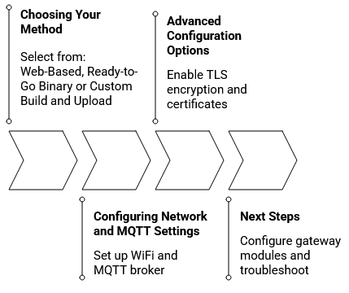

# Upload

OpenMQTTGateway provides several installation approaches suited for different use cases. The quickest path uses pre-built binaries that work with standard configurations. For custom parameters or specific gateway module combinations, you can build firmware using your development environment. Alternatively, you can flash devices directly from your web browser without installing any software.

  

## Choosing Your Upload Method

### Web-Based Installation

The [web installation](web-install.md) method represents the easiest way to get started with OpenMQTTGateway. You can flash your device directly from your browser without downloading files or installing development tools. This method works on Windows, macOS, and Linux with Chrome, Edge, or Opera browsers.

The web installer displays available environments for different boards and gateway configurations. Select your board type, connect via USB, and click the connect button. The installer handles everything automatically, including erasing old firmware and writing the new one. The web installer uses [ESP Web Tools](https://esphome.github.io/esp-web-tools/) technology to communicate directly with your ESP device.

### Ready-to-Go Binary Installation

[Downloading and installing pre-built binaries](binaries.md) offers control over the flashing process using desktop tools. Download the binary files for your board from the [GitHub releases page](https://github.com/1technophile/OpenMQTTGateway/releases).

For ESP32 devices, you need the firmware binary, bootloader, and boot application partition files written to specific memory addresses. Windows users can use the ESP32 Flash Download Tool from Espressif. On Linux and macOS, the esptool.py command-line utility provides a straightforward upload method.

This method works well for standard configurations without modifying source code. After flashing, you can still configure WiFi, MQTT broker settings, and basic parameters through the configuration portal.

### Custom Build and Upload

[Building from source](builds.md) becomes necessary when you need specific pin assignments, custom MQTT topics, or particular gateway module combinations not available in pre-built binaries.

[PlatformIO](https://platformio.org/) provides the recommended build environment. After downloading the [source code from GitHub](https://github.com/1technophile/OpenMQTTGateway), you will find a `platformio.ini` file defining build environments for various hardware combinations.

The configuration system uses a layering approach where default values from [`User_config.h`](https://github.com/1technophile/OpenMQTTGateway/blob/development/main/User_config.h) and [`config_XX.h`](https://github.com/1technophile/OpenMQTTGateway/tree/development/main) files can be overridden by build flags in `platformio.ini` or `environments.ini`. You can embed WiFi credentials and MQTT settings at build time for automatic connection on first boot.

### Browser-Based Building with Gitpod

For those who want to build custom firmware without setting up a local development environment, [Gitpod](gitpod.md) offers a cloud-based solution. By clicking on the [Gitpod link](https://gitpod.io#https://github.com/1technophile/OpenMQTTGateway/tree/development), you get a complete development environment running in your browser with PlatformIO already installed and configured.

After the automatic initial build completes, modify the environment configuration by editing `environments.ini` and run build commands in the browser terminal. Download the generated firmware files and flash them using the binary installation method.

## Configuring Network and MQTT Settings

After flashing firmware, configure network connectivity and MQTT broker settings using either runtime or build-time approaches.

### Runtime Configuration Portal

When you power on a freshly flashed device, it creates a WiFi access point named OpenMQTTGateway or starting with OMG_. You can find detailed information about the [configuration portal here](portal.md).

Connecting to this access point opens a portal where you configure your WiFi network, MQTT broker details, and optional security settings including TLS encryption and certificates. For devices with Ethernet, access the portal through the LAN IP address and configure WiFi as fallback connectivity.

The portal accepts broker IP addresses or hostnames with mDNS support like homeassistant.local. Set a gateway password to protect future configuration changes, OTA updates, and web interface access.

### Build-Time Configuration

Alternatively, embed network and MQTT settings directly in firmware during the build process. Set parameters in `User_config.h` or add them as build flags in your PlatformIO environment definition. Store sensitive information in a separate `_env.ini` file excluded from version control.

## Advanced Configuration Options

Beyond basic connectivity, OpenMQTTGateway supports several [advanced features](advanced-configuration.md) that enhance security and integration capabilities.

### Secure MQTT Connections

For deployments over the internet or public networks, enable TLS encryption to secure communication between the gateway and MQTT broker. Configure your broker with a valid certificate and obtain the Certificate Authority certificate. The gateway can verify server identity against this certificate or connect with encryption without validation.

Provide the CA certificate at build time in `default_server_cert.h` or paste it into the configuration portal. The gateway supports both self-signed certificates and those from public certificate authorities.

### Home Assistant Auto-Discovery

When you use [Home Assistant](https://www.home-assistant.io/) as your home automation platform, OpenMQTTGateway automatically creates device entries and sensors through Home Assistant's MQTT discovery protocol, enabled by default in all standard builds.

Enable discovery in your Home Assistant MQTT integration settings and create a dedicated MQTT user. The gateway registers itself as a device and creates sensor entities automatically, appearing in Configuration → Devices section.

### Topic Customization

The gateway publishes messages to MQTT topics following the format `home/OpenMQTTGateway/GATEWAYtoMQTT`. Enable the `valueAsATopic` feature to append received values to the topic path, making topic-based filtering easier and avoiding warnings in certain controllers.

## Next Steps

After successfully uploading firmware and configuring your gateway, you can proceed to configure specific gateway modules for [RF](../setitup/rf.md), [IR](../setitup/ir.md), [Bluetooth](../setitup/ble.md), [LoRa](../setitup/lora.md), or other protocols you want to use. Each module has configuration options adjustable through MQTT commands or the web interface without rebuilding firmware.

The [troubleshooting section](troubleshoot.md) covers common issues, but if you encounter problems not addressed here, the [OpenMQTTGateway community forum](https://community.openmqttgateway.com) provides an active place to ask questions and share solutions with other users.
